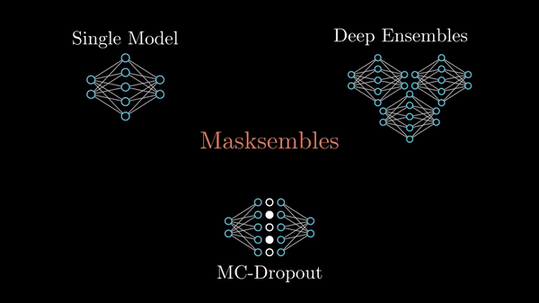

# Masksembles for Uncertainty Estimation

### [Project Page](https://nikitadurasov.github.io/projects/masksembles/) | [Paper](https://arxiv.org/abs/2012.08334) | [Video Explanation](#) 

Official implementation of Masksembles approach from the paper "Masksembles for Uncertainty Estimation" by
 Nikita Durasov, Timur Bagautdinov, Pierre Baque, Pascal Fua. In 2021 IEEE/CVF Conference on Computer Vision and Pattern Recognition (CVPR)

 

## Installation

### Torch 

```python 
import torch
from masksembles.torch import Masksembles2D

layer = Masksembles1D(10, 4, 2.)
layer(torch.ones([4, 10]))
```
```bash
tensor([[0., 1., 0., 0., 1., 0., 1., 1., 1., 1.],
        [0., 0., 1., 1., 1., 1., 0., 0., 1., 1.],
        [1., 0., 1., 1., 0., 0., 1., 0., 1., 1.],
        [1., 0., 0., 1., 1., 1., 0., 1., 1., 0.]], dtype=torch.float64)

```

### Tensorflow / Keras

```python 
import tensorflow as tf 
from masksembles.torch import Masksembles2D

layer = Masksembles1D(4, 2.)
layer(torch.ones([4, 10]))
```
```bash
<tf.Tensor: shape=(4, 10), dtype=float32, numpy=
array([[0., 1., 1., 0., 1., 1., 1., 0., 1., 0.],
       [0., 1., 0., 1., 1., 0., 1., 1., 0., 1.],
       [1., 1., 1., 1., 0., 0., 1., 0., 0., 1.],
       [1., 0., 0., 1., 0., 1., 1., 0., 1., 1.]], dtype=float32)>
```

## Usage 